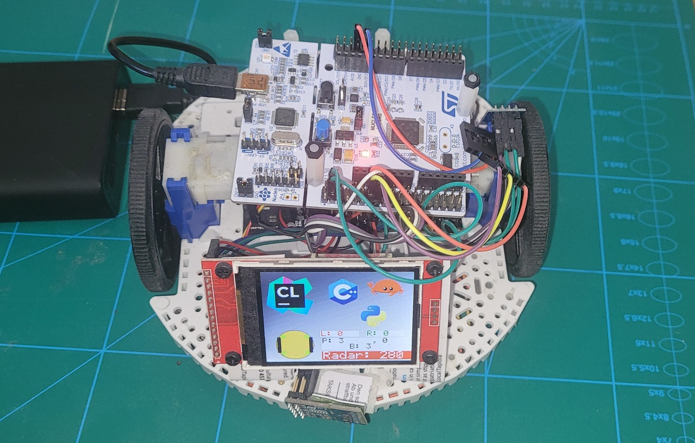

# Deskovery bot firmware

This is a Jetbrains Hackaton 2019 projet.

An example how to mix Rust, C, and C++ languages to make a bare-metal firmware.

The firmware runs a bot equipped with:
 * STM Nucleo-L467RG board as a head device
 * Two brushed DC motors with encoders
 * ESP8266 WiFi module
 * Four simple optical surface sensors
 * ToF distance sensor vl53l1x
 * LCD screen

